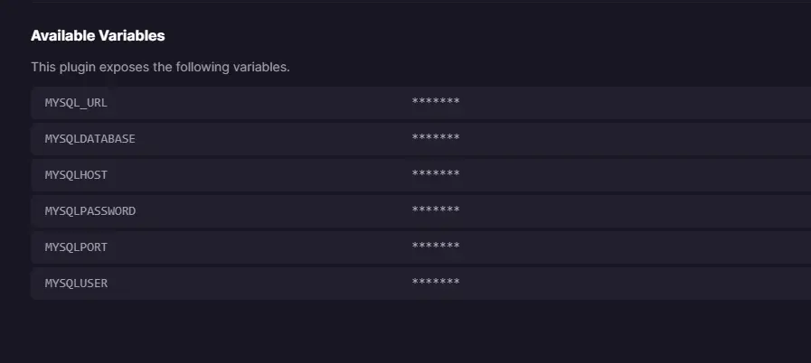
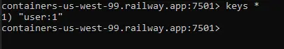
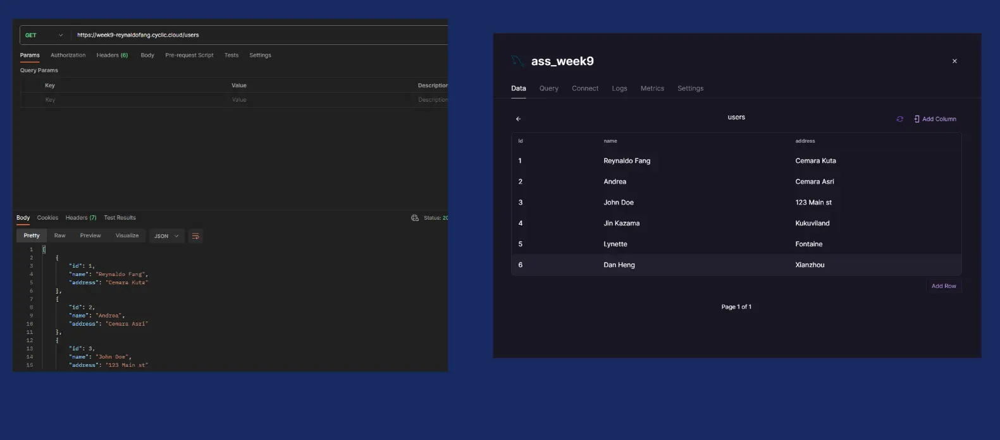
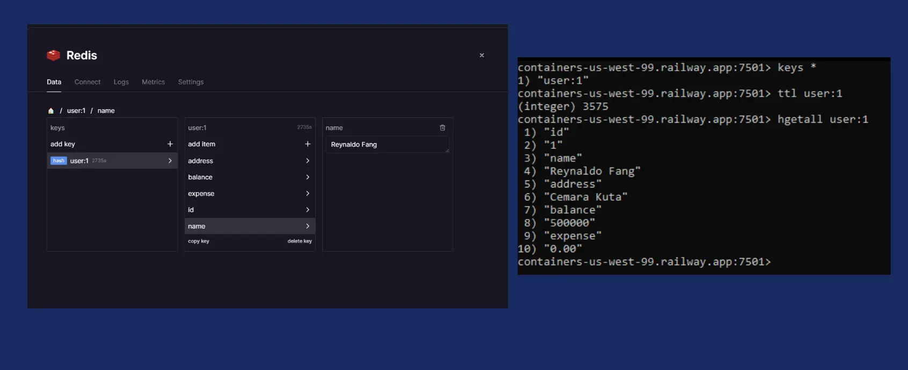
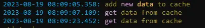

# Week 9 Assignment Backend Implementation - Full-Stack Engineering

This is assigment in week 9 focus about Backend Implementation - NodeJs, MYSQL, Redis.

- Create table in MySQL Database.
- Connect NodeJS to MySQL RDMBS to perform CRUD operations.
- (Advance Assigment) Can make cache use **Redis**.

If you want to follow me on social media, you can directly click the link below.

[](https://www.linkedin.com/in/reynaldo-fang/)
[](https://www.instagram.com/reynaldo.fang/)
[](mailto:reynaldofang02@gmail.com)


## MySQL & Redis Implementation & Result:


### MySQL

Deploy MySQL in **Railway** is Simple just Click **Start New Project** and Select **Provision MySQL**

Just waiting loading and done.

For Connect the NodeJS into the MySQL in **Railway**

Just change this in your database local createConnection

```
const mysql = require("mysql2");

const db = mysql.createConnection({
  host: "MYSQLHOST",
  port: "MYSQLPORT",
  user: "root",
  password: "MYSQLPASSWORD",
  database: "MYSQLDATABASE",
});
```

You can see this in **Connect** Area and see the **Available Variables** 



### Redis

When you want see the cache is inside the redis deploy in **Railway** or not.

you can hit the data in **Command Prompt** use docker and call redis-cli. use port redis in railway.

the syntax of call redis in **Railway** is

```
docker run -it --rm redis redis-cli -h <hostname> -p <port> -a <password>
```

The Result will like this


Now Your Redis Connected in **Railway**




So This is The Result In MySQL & Redis In **Railway**





This Result when you hit the Back-End API take from the cache.


### Deploy Link

You can hit Back-End API here (Use **Postman**)

[https://week9-reynaldofang.cyclic.cloud ](https://week9-reynaldofang.cyclic.cloud)

| Name                         | HTTP Method | Endpoint                                                                       | Requirements                                                                                        |
| ---------------------------- | ----------- | ------------------------------------------------------------------------------ | --------------------------------------------------------------------------------------------------- |
| **All List User**            | `GET`       | `/users`                               |
| **User by ID**     | `GET`       | `/users/:id`                  | Request Params: `id: number`
| **All List Transaction**          | `GET`       | `/transactions`                 |                                                                        |
| **Create New Transaction**       | `POST`      | `/transactions`                  | Request Body: `user_id: number, type: string, amount: number`                                       |
| **Update Transaction by ID** | `PUT`       | `/transactions/:id`| Request Params: `id: number` <br> <br>Request Body: `user_id: number, type: string, amount: number` |
| **Delete Transaction by ID** | `DELETE`    | `/transactions/:id`            | Request Params: `id: number`                                                                        |
| **Get Transaction by User** | `GET`    | `/transactions/user/:userId`            | Request Params: `userId: number`                                                                        |

That all!!

I hope the steps I explained above are clear to you.

Hopefully, you can use the website that I provided.

Thankyou.


